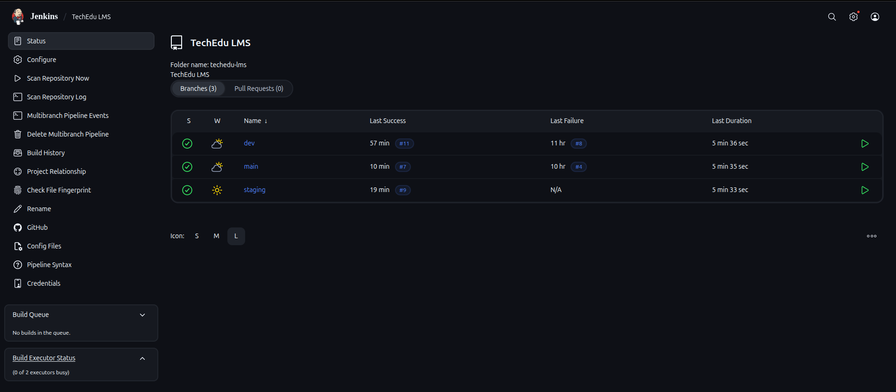
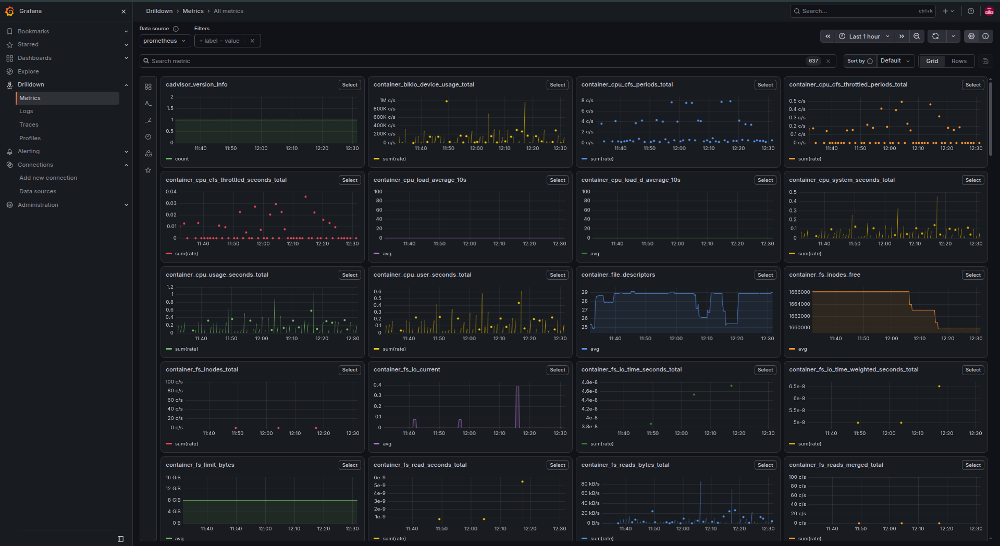
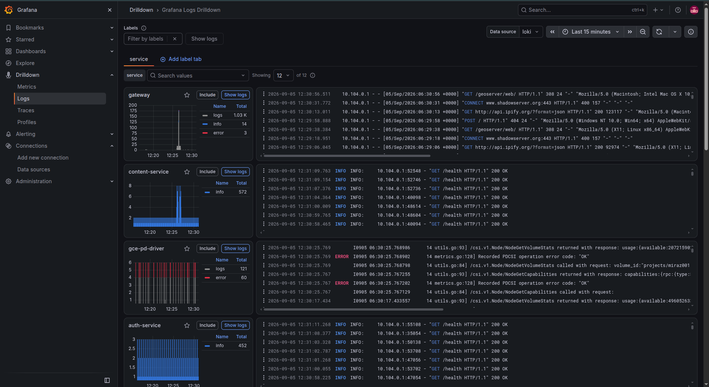
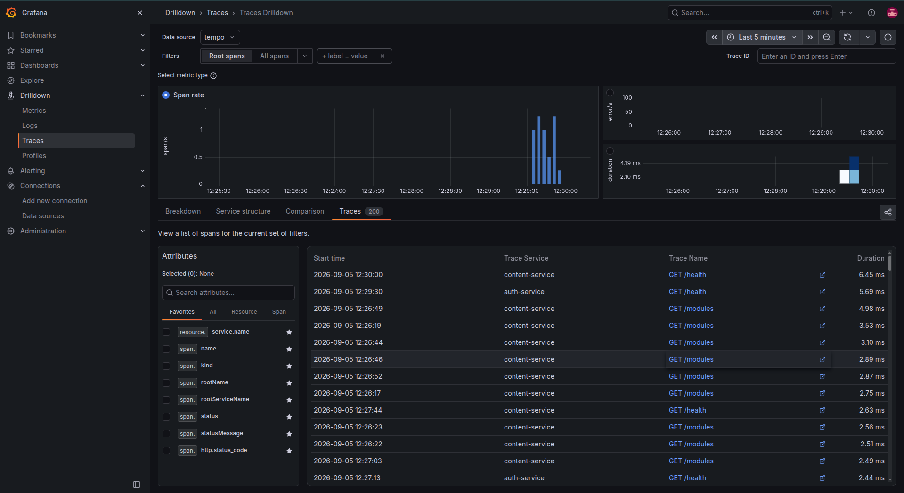

# TechEdu LMS

**A production-shaped Learning Management System, built and deployed end-to-end — three-environment CI/CD, Kubernetes on GKE, and a full metrics/logs/traces observability stack, all self-hosted.**

---

## Table of Contents

- [Overview](#overview)
- [Highlights](#highlights)
- [Architecture](#architecture)
- [CI/CD Pipeline](#cicd-pipeline)
- [Observability Stack](#observability-stack)
- [Engineering Challenges Solved](#engineering-challenges-solved)
- [Tech Stack](#tech-stack)

---

## Overview

TechEdu is a full-stack DevOps learning platform — a public landing page, an admin panel, and a student learning portal, backed by two FastAPI microservices and a self-hosted MySQL database. It runs across three fully isolated environments (`dev`, `staging`, `main`), each with its own Kubernetes namespace, static IP, database, and secrets, deployed automatically on every push with zero manual steps between a code change and it running live.

This isn't a tutorial project wired together from defaults — every layer, from the Nginx routing scheme to the CI/CD tag strategy to the observability pipeline, was designed, tested, and in several cases redesigned after hitting and diagnosing real infrastructure bugs along the way.

## Highlights

- Designed and shipped a **3-environment CI/CD pipeline** (Jenkins → Docker Hub → GKE) triggered automatically on every git push
- Collapsed a **4-external-IP-per-environment architecture down to 1** via Nginx path-based routing, cutting cloud IP quota usage by 75%
- Built a **cluster-wide observability stack from scratch** — metrics, logs, and traces — using Grafana Alloy, Prometheus, Loki, and Tempo, all self-hosted
- Instrumented backend services with **OpenTelemetry** for real request-level tracing, then enabled Tempo's metrics-generator to derive request-rate and latency metrics directly from trace data
- Diagnosed and fixed multiple non-obvious production infrastructure bugs (detailed below), each isolated through direct evidence rather than guesswork

## Architecture

Three Next.js frontends and two FastAPI backend services sit behind a single Nginx gateway per environment, which handles path-based routing to every app and proxies API calls to the correct microservice. This means each environment needs only **one external IP and one entry point**, regardless of how many services run behind it. Backend services use JWT authentication and connect to a dedicated MySQL instance per environment, with retry-hardened startup logic to handle database availability timing during pod restarts.
                 ┌─────────────────────────┐
                 │   Nginx Gateway (1 IP)  │
                 └────────────┬────────────┘
          ┌───────────────────┼───────────────────┐
          ▼                   ▼                   ▼
    Landing (/)          Admin (/admin)     Portal (/portal)
                                                    │
                         ┌──────────────────────────┘
                         ▼
                ┌─────────────────┐      ┌──────────────────┐
                │  auth-service   │◄────►│ content-service   │
                └────────┬────────┘      └────────┬─────────┘
                         └──────────┬──────────────┘
                                    ▼
                                MySQL

## Application Screens

**Landing page** — public-facing marketing site with sign-up flow

**Student portal** — where approved students access their course modules

**Admin panel — Users** — approve signups and manage student accounts

**Admin panel — Content** — manage course modules and resources

## CI/CD Pipeline

Jenkins runs a multibranch pipeline triggered automatically on every push to `dev`, `staging`, or `main`. Each run builds and tests all five services in parallel, builds Docker images tagged both by branch and by an immutable build number, pushes them to Docker Hub, and deploys directly to the matching Kubernetes namespace via `kubectl apply -k`.

## Observability Stack

### Application Instrumentation

Both backend services are instrumented with the **OpenTelemetry SDK**, emitting traces and metrics directly from application code rather than inferring them from network traffic. Every request carries a span with route, status, and timing data, feeding the entire observability pipeline below with genuine request-level fidelity.

### Metrics

A Grafana Alloy agent runs as a Kubernetes DaemonSet, scraping every node's kubelet (cAdvisor) for real per-pod CPU and memory usage across all three namespaces, combined with host-level Node Exporter metrics — a complete picture from individual pod resource usage up to overall server health, in a self-hosted Prometheus instance.

### Logs

The same Alloy DaemonSet tails logs from every pod in every namespace and ships them to a self-hosted Loki instance — centralized, searchable, filterable logs across the entire platform, with no need to `kubectl logs` into individual pods.

### Traces

Traces flow into a self-hosted Tempo instance, where the metrics-generator additionally derives request-rate, error-rate, and latency metrics directly from trace data and feeds them back into Prometheus — enabling full trace search, individual trace inspection, and span-rate/latency graphs from the same underlying data.

### Unified Dashboard

All three signals converge in a single Grafana dashboard: host-level VM metrics, per-pod resource usage filterable by namespace, live application logs, and direct links into trace search.

## Engineering Challenges Solved

A few of the real, non-obvious problems debugged and fixed during this build:

- **GKE pod-to-VM network gap**: Kubernetes pods use a separate CIDR range from node primary IPs, which meant the observability agent's traffic wasn't covered by GCP's default internal-allow firewall rule. Isolated via direct `nc` connectivity testing and fixed with a targeted firewall rule.
- **Silent stale deploys**: Reusing a mutable Docker tag per branch meant GKE's registry cache could serve stale image content even with `imagePullPolicy: Always`. Fixed by switching deploys to immutable, build-numbered tags — which also unlocked precise rollback capability.
- **Next.js `basePath` failing only in production**: A `basePath`-configured app worked in every local test but broke identically once containerized. Root-caused to `next.config.js` never being copied into the Docker runtime image — required at runtime, not just at build time.
- **Tempo trace-metrics gap**: Grafana's Traces Drilldown view failed with a cryptic gRPC error until identifying that it specifically requires Tempo's `local-blocks` processor, distinct from the `span-metrics`/`service-graphs` processors already configured.

## Tech Stack

| Layer | Technologies |
|---|---|
| Frontend | Next.js |
| Backend | FastAPI, MySQL |
| Gateway | Nginx |
| Containers & Orchestration | Docker, Kubernetes (GKE) |
| CI/CD | Jenkins |
| Observability | OpenTelemetry, Grafana, Prometheus, Loki, Tempo, Grafana Alloy |
EOF